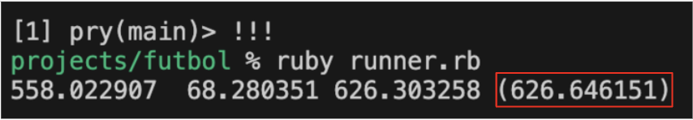
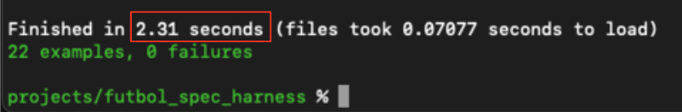
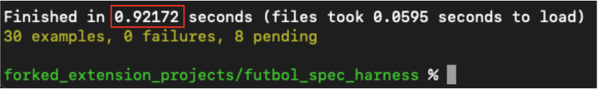

# Futbol

### Objective
 - Take data from CSV files, and calculate various statistics, such as "Best Season for a Team", "Winningest Coach", and "Highest Scoring Home Team". We were given a testing suite which we needed to pass in less than 10 minutes. Some tests were considered optional, but should not effect the runtime greatly.
 
 Starter repository for the [Turing School](https://github.com/turingschool-examples/futbol) Futbol project.

### Context 

- This project was given to us in our fourth week at Turing School of Software and Design. We were split into teams of four, and had a secondary objective of learning how to use git and github effectively in a team setting. 

- There is quite a bit of code in this repository that is far from ideal, but I have decided to leave it untouched to demonstrate how I learned clean, DRY, convetional code over the course of my time at Turing.

### Concepts Demonstrated

- Object Oriented Programing Using Ruby

- Optimization (ASK ME ABOUT THIS): Project Requirement was 10 minutes, fair performance was considered 45 seconds, good performance was under 5 seconds. I was able to get this to run in under 1 second.

- Primitive Extract and Transform portion of ETL pipeline

- Use of Github in a team setting for the first time

<hr>

Initial 10 minute runtime



Optimization down to <5 seconds at the time of submission



Further optimization down to <1 second after submission



<hr>


### Run The Program

1. Create a parent repository that can host both the main repository and the test suite

2. Clone the repo into this parent repository.
   ```sh
   git@github.com:mbkuhl/futbol.git 
   ```
3. Clone the testing suite into the parent repository along the main repo.
   ```sh
   git@github.com:mbkuhl/futbol_spec_harness.git
   ```
   
   The final file structure should look like the following:

     ```
    <some_directory>
    |
    |\
    | \<futbol>
    |
    |\
    | \<futbol_spec_harness>
  ```

4. Gem Bundle for each repo.
   ```sh
    cd futbol
    bundle

    cd ../futbol_spec_harness
    bundle
   ```

5. Run the tests
  ```sh
    bundle exec rspec
   ``` 

  Some tests will be skipped. These were the optional tests mentioned above.

  If you run into the following error while running bundle exex rspec

  ```sh
    /Users/(your user)/.rbenv/versions/3.2.2/lib/ruby/gems/3.2.0/gems/bundler-1.16.1/lib/bundler/shared_helpers.rb:266:in `search_up': undefined method `untaint' for "/Users/(your user)/(your file path)/futbol_spec_harness":String (NoMethodError)

      current  = File.expand_path(SharedHelpers.pwd).untaint
  ```

  delete the Gemfile.lock in the testing suite and rerun ```bundle install```


<p align="right">(<a href="#readme-top">back to top</a>)</p>


# Contributors
* Michael Kuhlmeier
-  https://www.linkedin.com/in/michaelkuhlmeier/
-  https://github.com/mbkuhl
* Miranda Delaney 
-  https://www.linkedin.com/in/mld52/
-  https://github.com/delaneymiranda1
* Sooyung Kim
-  https://www.linkedin.com/in/sooyung-k-94544558/
-  https://github.com/skim1027
* Scott DeVoss
-  https://www.linkedin.com/in/scott-devoss-340582159/
-  https://github.com/scottdevoss

# Retro

#### The name of and links (if applicable) to any tools you used for retro
- [jamboard](https://jamboard.google.com/d/1qi9eb-XNlEaWBuKQhauvBAM0Iv-SzG8grAJMSM32wGI/viewer?userstoinvite=kuhlmmb%40gmail.com&sharingaction=manageaccess&role=writer&ts=650cc9eb&f=3)

#### Top 3 things that went well during your project
- We communicate consistently.
- We are always willing to help each other.
- Work was split evenly.

#### Top 3 things your team would do differently next time
- Set up github standards better.
- Discuss helper methods earlier on.
- Take better breaks. 